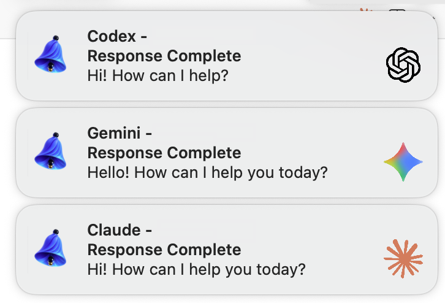

# AI Notifier

<p align="center">
  
</p>

<p align="center">
  
</p>

Native macOS notification app for AI coding assistants (Claude Code, Gemini CLI, Codex CLI, OpenCode)

Built with Swift using the `UNUserNotificationCenter` API, fully compatible with all recent macOS versions including Sequoia and Tahoe.

## Key Features

**Native Swift App**
- No external dependencies (no terminal-notifier, Node.js required)
- Universal Binary (Intel + Apple Silicon)
- Uses modern macOS notification API

**Multi-CLI Support**
- Auto-detects Claude Code, Gemini CLI, Codex CLI, OpenCode
- CLI-specific icons
- Notifications for response completion and permission requests

**Click-to-Focus**
- Click notification to jump to the terminal
- Supports iTerm2, Terminal.app, VSCode, Kitty, and more
- Precise tab/session selection (varies by terminal)

**ntfy Integration** (optional)
- Mobile push notifications via [ntfy.sh](https://ntfy.sh)
- Self-hosted ntfy server support (Bearer/Basic auth)

**Multi-language Support**
- 8 languages: English, Korean, Japanese, Chinese (Simplified), Spanish, German, Russian, Hindi
- Auto-selects based on macOS system language
- English is the default/fallback language

---

## Installation

### One-liner Install (Recommended)

```bash
rm -rf /tmp/ai-notifier-swift && \
git clone https://github.com/sokojh/ai-notifier-swift.git /tmp/ai-notifier-swift && \
/tmp/ai-notifier-swift/install.sh
```

The install script automatically:
1. Builds the Swift app (Universal Binary)
2. Installs to `/Applications/ai-notifier.app`
3. Configures hooks for Claude Code, Gemini CLI, Codex CLI, OpenCode
4. Requests notification permissions

### Manual Installation

```bash
git clone https://github.com/sokojh/ai-notifier-swift.git
cd ai-notifier-swift
./build.sh
cp -r .build/ai-notifier.app /Applications/
codesign --force --deep --sign - /Applications/ai-notifier.app

# Run setup wizard (permissions + hook installation)
/Applications/ai-notifier.app/Contents/MacOS/ai-notifier --setup
```

---

## Notification Permissions

After installation, go to **System Settings → Notifications → AI Notifier**:

1. Enable **Allow Notifications**
2. Set notification style to **Alerts** (recommended over Banners)

---

## Terminal Support

### Full Support (Tab/Session Selection)

| Terminal | Method | Notes |
|----------|--------|-------|
| **iTerm2** | `ITERM_SESSION_ID` (UUID) | Jumps to exact session |
| **Terminal.app** | TTY matching | Jumps to exact tab |

### Partial Support (Window Activation)

| Terminal/IDE | Method | Notes |
|--------------|--------|-------|
| **VSCode** | `code` CLI | Activates folder window (cannot select internal terminal tab) |
| **Kitty** | `kitten @` | Focus by window ID → **Requires remote control setting** |
| **Cursor** | `cursor` CLI | VS Code fork - activates folder window |
| **Zed** | `zed` CLI | Activates folder window |
| **JetBrains IDEs** | CLI + AppleScript | PhpStorm, IntelliJ, WebStorm, PyCharm, etc. (activates project window) |
| **Ghostty** | AppleScript | App activation only (no session API) |
| **Warp** | AppleScript | App activation only (cannot select tab) |

### Additional Setup Required

**Kitty**: Add to `~/.config/kitty/kitty.conf`:
```
allow_remote_control yes
```

### IDE Detection Methods

| IDE | Environment Variable | Notes |
|-----|---------------------|-------|
| **JetBrains** | `TERMINAL_EMULATOR=JetBrains-JediTerm` | All JetBrains IDEs ([source](https://github.com/JetBrains/jediterm/issues/253)) |
| **Cursor** | `CURSOR_AGENT` or `CURSOR_CLI` | ⚠️ `TERM_PROGRAM=vscode` inherited ([source](https://github.com/getcursor/cursor/issues/1760)) |
| **Zed** | `ZED_TERM=true` | ([source](https://github.com/zed-industries/zed/issues/4571)) |

---

## ntfy Integration (Optional)

Receive notifications on mobile or other devices.

### Configuration

```bash
mkdir -p ~/.config/ai-notifier
cat > ~/.config/ai-notifier/config.json << 'EOF'
{
  "ntfy": {
    "enabled": true,
    "server": "https://ntfy.sh",
    "topic": "your-unique-topic-name",
    "priority": "default"
  }
}
EOF
```

### Configuration Options

| Option | Description | Default |
|--------|-------------|---------|
| `enabled` | Enable ntfy | `false` |
| `server` | ntfy server URL | `https://ntfy.sh` |
| `topic` | Topic name for notifications (required) | - |
| `priority` | Priority (`min`, `low`, `default`, `high`, `urgent`) | `default` |
| `auth` | Authentication info (optional) | `null` |

### Self-hosted ntfy Authentication

**Bearer Token:**
```json
{
  "ntfy": {
    "enabled": true,
    "server": "https://your-ntfy-server.com",
    "topic": "your-topic",
    "auth": { "type": "bearer", "token": "tk_your_token" }
  }
}
```

**Basic Auth:**
```json
{
  "ntfy": {
    "enabled": true,
    "server": "https://your-ntfy-server.com",
    "topic": "your-topic",
    "auth": { "type": "basic", "username": "user", "password": "pass" }
  }
}
```

### Mobile App

1. Install [ntfy app](https://ntfy.sh/#subscribe-phone) (iOS/Android)
2. Subscribe to your configured topic
3. Receive notifications on mobile when AI responses complete

---

## CLI Hook Configuration (Manual)

Hooks are automatically configured when using `install.sh` or `--setup`. For manual configuration:

<details>
<summary><strong>Claude Code</strong></summary>

`~/.claude/settings.json`:
```json
{
  "hooks": {
    "Stop": [{"matcher": "", "hooks": [{"type": "command", "command": "/Applications/ai-notifier.app/Contents/MacOS/ai-notifier"}]}],
    "Notification": [{"matcher": "permission_prompt", "hooks": [{"type": "command", "command": "/Applications/ai-notifier.app/Contents/MacOS/ai-notifier"}]}]
  }
}
```
</details>

<details>
<summary><strong>Gemini CLI</strong></summary>

`~/.gemini/settings.json`:
```json
{
  "hooks": {
    "enabled": true,
    "AfterModel": [{"hooks": [{"name": "ai-notifier", "type": "command", "command": "/Applications/ai-notifier.app/Contents/MacOS/ai-notifier", "timeout": 5000}]}],
    "Notification": [{"hooks": [{"name": "ai-notifier", "type": "command", "command": "/Applications/ai-notifier.app/Contents/MacOS/ai-notifier", "timeout": 5000}]}]
  }
}
```
</details>

<details>
<summary><strong>Codex CLI</strong></summary>

`~/.codex/config.toml` (Note: `notify` must be at **root level**!):
```toml
# Place at root level (important!)
notify = ["/Applications/ai-notifier.app/Contents/MacOS/ai-notifier"]

# [notice] section is for different purpose (in-product notices)
[notice]
hide_gpt5_1_migration_prompt = true
```
</details>

<details>
<summary><strong>OpenCode</strong></summary>

OpenCode uses `@opencode-ai/plugin` SDK-based plugin system. Auto-installed when running `--setup`.

**Plugin location:** `~/.config/opencode/plugin/ai-notifier.ts`

```typescript
import type { Plugin } from "@opencode-ai/plugin";
import { execSync } from "child_process";
import { basename } from "path";

function notify(eventType: string, projectName: string, responsePreview?: string) {
  try {
    const cwd = process.cwd();
    const data = JSON.stringify({
      hook_event_name: eventType,
      cwd: cwd,
      cli: "opencode",
      project_name: projectName || basename(cwd),
      response_preview: responsePreview || ""
    });
    execSync(`echo '${data.replace(/'/g, "'\\''")}' | /Applications/ai-notifier.app/Contents/MacOS/ai-notifier`, {
      stdio: 'ignore',
      timeout: 5000
    });
  } catch (e) {
    // Ignore errors silently
  }
}

export const AiNotifierPlugin: Plugin = async ({ directory }) => {
  const projectName = basename(directory);
  let lastResponseText = "";

  return {
    event: async (eventData: any) => {
      const eventType = eventData?.event?.type;
      const props = eventData?.event?.properties;

      // Track assistant response text
      if (eventType === "message.part.updated") {
        const part = props?.part;
        if (part?.type === "text" && part?.text) {
          lastResponseText = part.text.trim();
        }
      }

      if (eventType === "session.idle") {
        notify("complete", projectName, lastResponseText.substring(0, 200));
        lastResponseText = "";
      } else if (eventType === "session.error") {
        notify("error", projectName);
        lastResponseText = "";
      }
    },

    "permission.ask": async () => {
      notify("permission", projectName);
    }
  };
};

export default AiNotifierPlugin;
```

**Supported events:**
- `session.idle` → Response complete notification
- `session.error` → Error notification
- `permission.ask` → Permission request notification
</details>

---

## How It Works

### Notification Flow

```
CLI response complete → Hook executed → ai-notifier called →
  ├─ Display macOS notification
  └─ Send to ntfy (if configured)
```

### Click-to-Focus Flow

```
Click notification → ai-notifier relaunched →
  Restore terminal info → Activate terminal/session
```

### Gemini CLI Debouncing

Gemini CLI calls hooks for every streaming response, so automatic debouncing is applied:
- Only notifies when `finishReason == "STOP"`
- 2-second per-session debouncing prevents duplicate notifications

---

## Testing

```bash
# Basic notification test
echo '{"hook_event_name":"Stop","cwd":"/tmp/test"}' | \
  /Applications/ai-notifier.app/Contents/MacOS/ai-notifier

# View debug logs
tail -f /tmp/ai-notifier-debug.log
```

---

## Internationalization

Notifications and UI automatically display in the appropriate language based on macOS system language settings.

### Supported Languages

| Language | Code | Status |
|----------|------|--------|
| English | en | Default (fallback) |
| Korean | ko | Supported |
| Japanese | ja | Supported |
| Chinese (Simplified) | zh-Hans | Supported |
| Spanish | es | Supported |
| German | de | Supported |
| Russian | ru | Supported |
| Hindi | hi | Supported |

### Changing Language

System Settings → General → Language & Region → Change preferred language order

### Adding New Languages (for developers)

1. Create `Resources/{lang-code}.lproj/Localizable.strings`
2. Copy keys from `en.lproj/Localizable.strings` and translate
3. Add language code to `CFBundleLocalizations` array in `build.sh`
4. Build and test

---

## Technical Specifications

| Item | Value |
|------|-------|
| Language | Swift 5+ |
| Minimum macOS | 11.0 (Big Sur) |
| Notification API | `UNUserNotificationCenter` |
| Architecture | Universal Binary (arm64 + x86_64) |
| Code Signing | Ad-hoc (local build) |
| Bundle ID | `com.sokojh.ai-notifier` |

---

## Why Native Swift?

| Tool | Issue |
|------|-------|
| terminal-notifier | Deprecated `NSUserNotification` API, doesn't support latest macOS |
| alerter | Same API issues |
| osascript | Terminal `display notification` doesn't work on Sequoia |

→ Solved with a native app using modern `UNUserNotificationCenter` API

---

## License

MIT License
